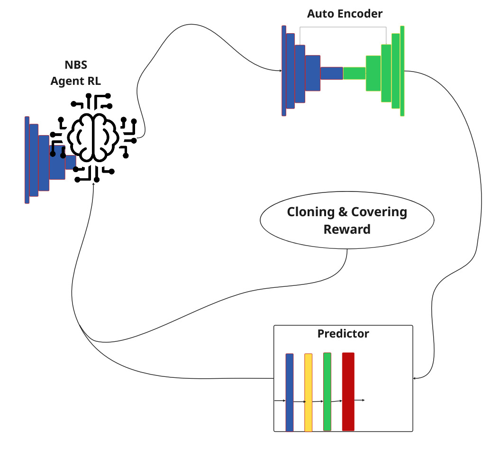
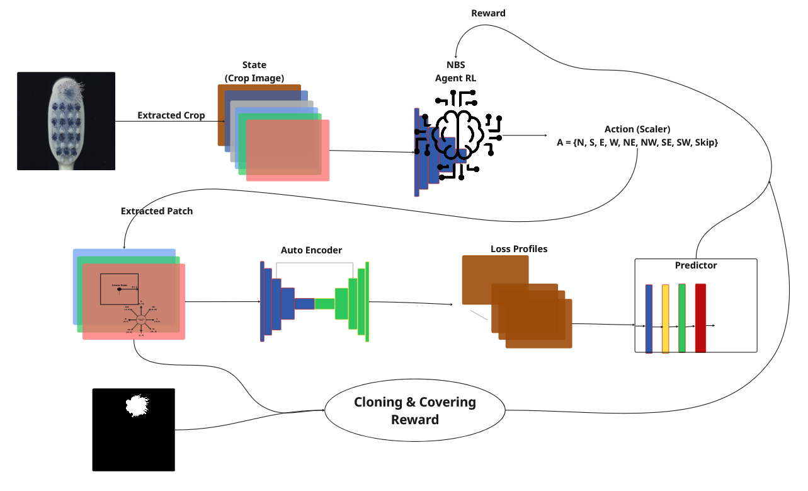
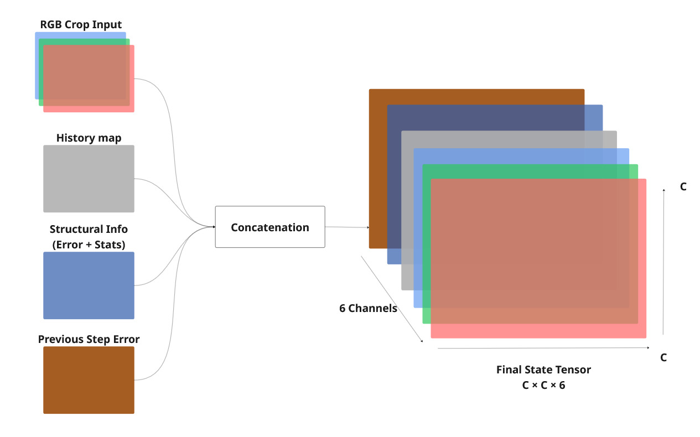
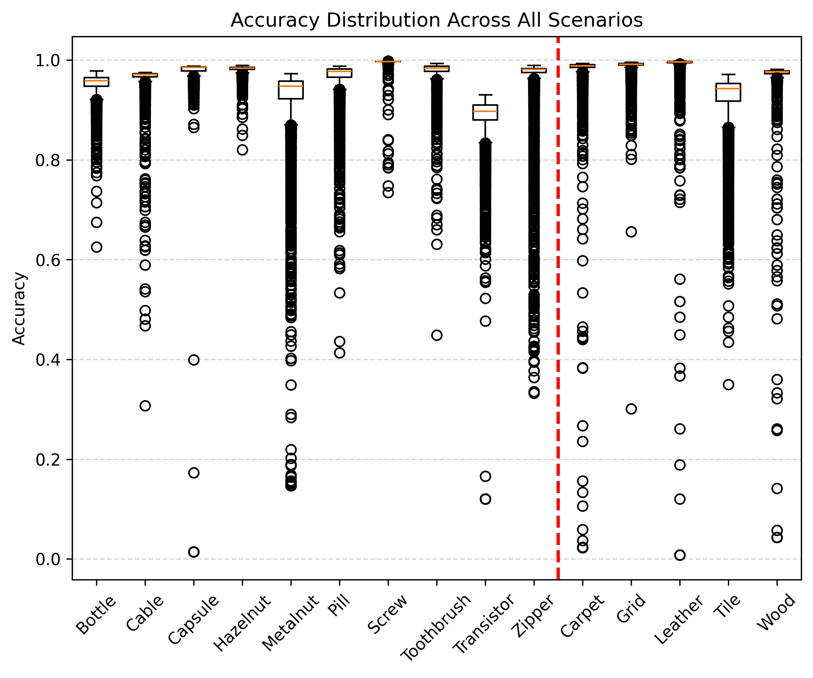
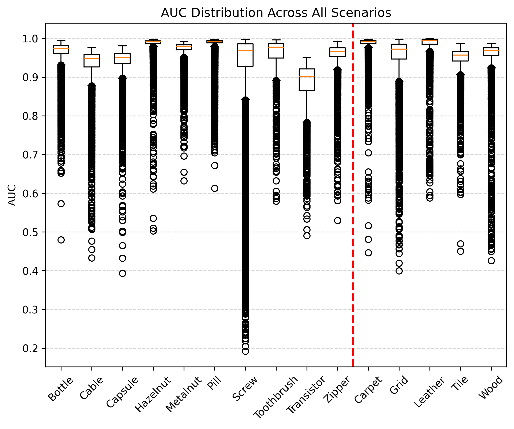
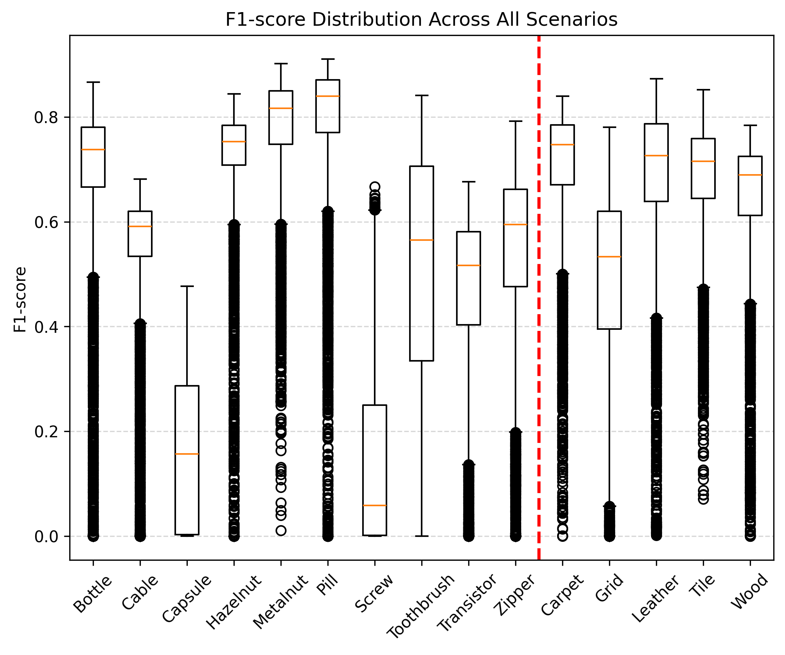
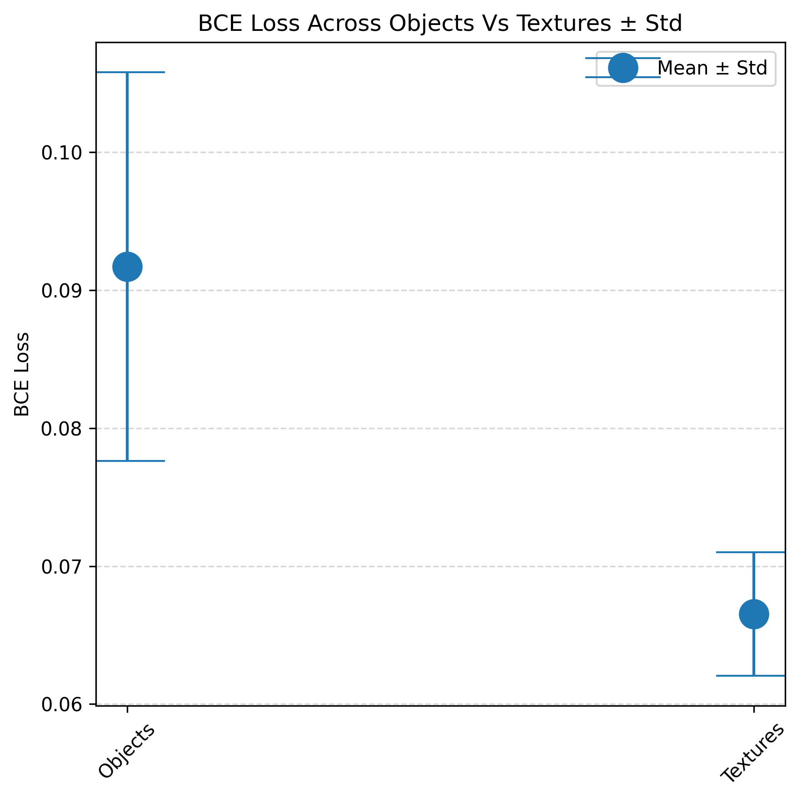
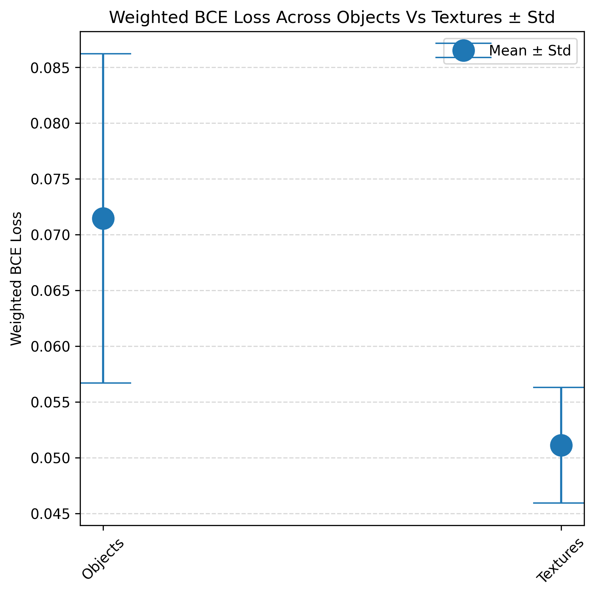

<div align="center">

# Neural Batch Sampling (NBS)

### Reinforcement Learning for Semi-Supervised Industrial Anomaly Detection

<p>
  
  
  
  
  
</p>

<p>
  <b>Neural Batch Sampling</b> learns where to look in an industrial image
  using reinforcement learning, enabling adaptive patch selection instead of
  relying solely on random or uniform sampling.
</p>

</div>

---

## 📌 Overview

Industrial anomaly detection often requires identifying subtle defects that may occupy only a small portion of an image.
A major challenge is therefore not only **how to detect anomalies**, but also **where to inspect the image**.

**Neural Batch Sampling (NBS)** addresses this problem by formulating patch selection as a sequential decision-making problem.

Instead of sampling image regions independently, an RL agent observes a structured state representation and learns to move through the image toward informative regions.

The framework combines:

- 🧠 Neural patch sampling
- 🎯 Reinforcement learning
- 🔍 Reconstruction-error information
- 📐 Structural information
- 📊 Coverage-based exploration
- 🤖 Predictor feedback
- 🏭 Industrial anomaly detection

---

# 🧩 Method at a Glance

<div align="center">



**Figure 1. Overview of the Neural Batch Sampling framework.**

</div>

The overall process can be summarized as:

```text
Industrial Image
      │
      ▼
Preprocessing
      │
      ▼
Autoencoder Reconstruction
      │
      ▼
Reconstruction / Structural Information
      │
      ▼
State Construction
      │
      ▼
┌─────────────────────────────┐
│   Neural Batch Sampler      │
│                             │
│   State → Policy → Action   │
└─────────────────────────────┘
      │
      ▼
Patch Selection
      │
      ▼
Predictor Feedback
      │
      ▼
Reward
      │
      └──────────────► Next State
```

The agent therefore learns a **sampling policy** rather than directly performing anomaly classification.

---

# 🔬 Why Neural Batch Sampling?

Traditional patch-based anomaly detection pipelines often rely on predefined sampling strategies such as:

- Random sampling
- Uniform grid sampling
- Fixed patch locations
- Hand-crafted heuristics

These approaches do not explicitly learn which regions are informative for the downstream anomaly-detection task.

NBS instead treats image exploration as an RL problem:

> **Given the current visual state, which spatial action should be taken next to obtain a more informative patch?**

This allows the sampling process to adapt to the structure and anomaly-related information present in the image.

---

# 🏗️ Model Architecture

<div align="center">



**Figure 2. Detailed NBS processing pipeline.**

</div>

The neural batch sampler receives a multi-channel state representation and predicts one of nine possible spatial actions.

### Core configuration

| Component             |          Configuration |
| --------------------- | ---------------------: |
| Input state channels  |                      6 |
| Input spatial size    |              128 × 128 |
| Selected patch size   |                64 × 64 |
| Movement step         |              24 pixels |
| Number of actions     |                      9 |
| First convolution     |                 6 → 16 |
| Second convolution    |                16 → 32 |
| Third convolution     |                32 → 32 |
| Fourth convolution    |                32 → 64 |
| Fifth convolution     |                64 → 64 |
| Fully connected layer |                    256 |
| Output                | 9 action probabilities |
| Normalization         |    Batch Normalization |
| Policy output         |                Softmax |

---

# 🧠 State Representation

The agent does not make decisions from RGB information alone.

The state incorporates visual and error-related information that describes the current region and its surrounding context.

<div align="center">



**Figure 3. State representation used by the Neural Batch Sampler.**

</div>

The state representation contains six channels combining information such as:

- RGB appearance
- Reconstruction-error information
- Structural information
- Previous error information
- Historical sampling information

This representation allows the policy to use both **appearance** and **sampling history** when selecting the next region.

---

# 🎯 Action Space

NBS uses a discrete nine-action spatial policy.

```text
              UP
               ↑

        ↖      ↑      ↗

        ←     STAY     →

        ↙      ↓      ↘

              DOWN
```

The nine actions are:

| Action | Movement    |
| -----: | ----------- |
|      0 | No movement |
|      1 | Left        |
|      2 | Right       |
|      3 | Up          |
|      4 | Down        |
|      5 | Up-Left     |
|      6 | Down-Left   |
|      7 | Up-Right    |
|      8 | Down-Right  |

Each movement changes the sampling location by the predefined movement step.

---

# 🎁 Reward Design

The sampling policy is optimized using a composite reward:

$$
R_{\text{total}}
=
\beta
\left(
R_{\text{clone}}
+
R_{\text{cover}}
\right)
+
(1-\beta)R_{\text{pred}}
$$

where:

- $R_{\text{clone}}$ provides structural / image-information feedback.
- $R_{\text{cover}}$ encourages exploration of previously insufficiently covered regions.
- $R_{\text{pred}}$ incorporates feedback from the anomaly predictor.
- $\beta$ controls the relative contribution of the sampling-related reward components.

This formulation allows the agent to balance **informative sampling**, **spatial coverage**, and **downstream prediction feedback**.

---

# 🔍 Information Used for Sampling

The framework combines several sources of information.

### Reconstruction Error

An autoencoder reconstructs the input image, and reconstruction discrepancies provide information that can be useful for identifying potentially anomalous regions.

### Structural Information

Sobel-based structural information is extracted from the image to capture local edge and texture characteristics.

### Fused Anomaly Signal

The implementation combines normalized reconstruction and structural statistics through a weighted formulation:

$$
F =
0.7\,MAE_z
+
0.1\,Var_z
+
0.2\,Grad_z
$$

followed by normalization.

This signal contributes to the state and sampling process.

---

# 📊 Experimental Results

The repository contains experiments across **object** and **texture** categories, together with scenario-level training and evaluation results.

## Overall Results

<div align="center">



**Figure 4. Accuracy distribution across the overall experiments.**

<br>



**Figure 5. AUC distribution across the overall experiments.**

<br>



**Figure 6. F1 distribution across the overall experiments.**

</div>

Additional overall analyses are available in:

```text
Resultes/Overall/
├── BCE_Across_overall.png
├── Weighted_BCE_Across_overall.png
├── BCE_Across_obj_vs_texture.png
├── Weighted_BCE_Across_obj_vs_texture.png
├── ACC_Distribution_Across_overall.png
├── AUC_Distribution_Across_overall.png
└── F1_Distribution_Across_overall.png
```

---

# 🏭 Object vs. Texture Analysis

NBS experiments include separate analyses for object-oriented and texture-oriented scenarios.

<div align="center">



**Figure 7. BCE comparison across object and texture scenarios.**

<br>



**Figure 8. Weighted BCE comparison across object and texture scenarios.**

</div>

Detailed category-level results are available under:

```text
Resultes/Overall/Objects/
Resultes/Overall/Textures/
```

---

# 📈 Training Dynamics

The repository also contains scenario-level visualizations showing how the models evolve during training.

For example, individual scenarios include:

```text
autoencoder_losses_over_training.png
prediction_losses_over_training.png
metrics_over_training.png
losspred_vs_acc.png
losspred_vs_auc.png
losspred_vs_f1.png
losspred_vs_metrics.png
top_10_comparison.png
worst_10_comparison.png
```

These visualizations make it possible to inspect the relationship between:

- Autoencoder reconstruction loss
- Prediction loss
- Sampling behavior
- Classification metrics
- Training dynamics

---

# 🔬 Reset Dynamics Simulation

The repository additionally contains a dedicated simulation study for analyzing the effect of periodic autoencoder resets.

```text
reset-ae-simulation/
├── experiment.py
├── main.py
└── src/
    ├── config.py
    ├── generate_trajectory.py
    ├── generate_reset.py
    ├── calculate_variance.py
    ├── calculate_theoretical.py
    ├── plot_results.py
    └── print_results.py
```

The simulation models reset events as stochastic events and studies their effect on reward variability.

> **Important:** This module is a simplified stochastic abstraction of reset dynamics rather than a full neural-network training simulation.

The theoretical component considers a reset indicator

$$
I_t \sim Bernoulli(p)
$$

and a reset-induced reward difference

$$
D_t = R(Z_t)-R(\theta_t).
$$

Under the stated assumptions, the variance contribution of the reset shock can be expressed as

$$
Var(I_tD_t)
=
p\sigma_D^2.
$$

The repository also includes numerical experiments for comparing simulated and theoretical behavior.

---

# 🗂️ Repository Structure

```text
NBS/
│
├── Code/
│   └── Step6/
│       └── main.py
│
├── Diagrams/
│   ├── overview_flowchart.jpg
│   ├── detail_flowchart.jpg
│   ├── nbs_state_schematic.jpg
│   └── image3.jpg
│
├── Resultes/
│   ├── Overall/
│   ├── Senarioes/
│   └── ...
│
├── reset-ae-simulation/
│   ├── experiment.py
│   ├── main.py
│   └── src/
│       ├── config.py
│       ├── generate_trajectory.py
│       ├── generate_reset.py
│       ├── calculate_variance.py
│       ├── calculate_theoretical.py
│       ├── plot_results.py
│       └── print_results.py
│
├── LICENSE
└── README.md
```

---

# ⚙️ Implementation Details

The current implementation is built with **PyTorch**.

### Neural Batch Sampler

```text
Input State
    │
    ▼
Conv 6 → 16
    │
    ▼
Conv 16 → 32
    │
    ▼
Conv 32 → 32
    │
    ▼
Conv 32 → 64
    │
    ▼
Conv 64 → 64
    │
    ▼
Flatten
    │
    ▼
FC → 256
    │
    ▼
FC → 9
    │
    ▼
Softmax
```

The policy produces a probability distribution over the nine spatial actions.

---

# 🧪 Experimental Scope

The repository contains experiments involving industrial anomaly-detection scenarios covering both:

### Objects

Examples include scenarios such as:

- Bottle
- Cable
- Capsule
- Hazelnut
- and other object categories

### Textures

Examples include:

- Carpet
- Grid
- and other texture-oriented scenarios

Scenario-specific results are organized under:

```text
Resultes/Senarioes/
```

---

# 🚀 Getting Started

## 1. Clone the repository

```bash
git clone https://github.com/amirhossein-khadivi/NBS.git
cd NBS
```

## 2. Install dependencies

The main implementation is based on Python and PyTorch.

A typical environment can be prepared with:

```bash
pip install torch torchvision numpy matplotlib scikit-learn opencv-python pillow
```

Depending on the exact experiment, additional dependencies may be required.

## 3. Configure the dataset

The current implementation contains dataset paths configured for the MVTec-style experimental setup.

Before running the code, update the paths in:

```text
Code/Step6/main.py
```

to match your local dataset and model locations.

## 4. Run the main implementation

```bash
python Code/Step6/main.py
```

---

# 🔁 Reproducibility

For reproducible experiments, the repository provides explicit configuration for the reset-dynamics simulation, including:

```python
T = 1000
K = 50
n_trajectories = 100
learning_rate = 0.005
ae_noise_std = 0.01
predictor_noise_std = 0.01
beta = 0.8
seed = 42
```

The simulation configuration can be modified through:

```text
reset-ae-simulation/src/config.py
```

---

# 📚 Research Components

| Component            | Role                                     |
| -------------------- | ---------------------------------------- |
| Autoencoder          | Reconstruction-based anomaly information |
| Structural filtering | Extract local image structure            |
| Neural Batch Sampler | Select informative image patches         |
| RL policy            | Learn sequential sampling decisions      |
| Coverage reward      | Encourage exploration                    |
| Predictor            | Provide downstream feedback              |
| Reward function      | Optimize the sampling strategy           |
| Simulation module    | Study reset-induced stochastic effects   |

---

# 🧠 Conceptual Contribution

The central idea behind NBS is to shift patch selection from a **static preprocessing operation** toward a **learned sequential decision process**.

Instead of asking:

> _Which patches should be sampled beforehand?_

the framework asks:

> _Given what has already been observed, where should the agent look next?_

This formulation makes the sampling strategy adaptive to the visual information encountered during exploration.

---

# 📁 Results and Visualizations

All generated figures are organized inside the `Resultes/` directory.

The repository includes:

- Overall metric distributions
- Object-level analysis
- Texture-level analysis
- Scenario-level training curves
- Loss/metric relationships
- Top-performing samples
- Worst-performing samples
- Autoencoder dynamics
- Prediction dynamics
- Reset simulation results

This structure is intended to make the experimental analysis directly inspectable from the repository.

---

# 📖 Citation

If you use this repository or the Neural Batch Sampling framework in your research, please cite the associated work:

```bibtex
@misc{khadivi_nbs,
  title  = {Neural Batch Sampling with Reinforcement Learning for Semi-Supervised Anomaly Detection},
  author = {Amirhossein Khadivi Noghredeh},
  note   = {Research implementation},
}
```

---

# 📄 License

This project is distributed under the license provided in:

```text
LICENSE
```

---

<div align="center">

### Neural Batch Sampling

**Learning where to look for industrial anomalies.**

<br>

[GitHub Repository](https://github.com/amirhossein-khadivi/NBS)

</div>
